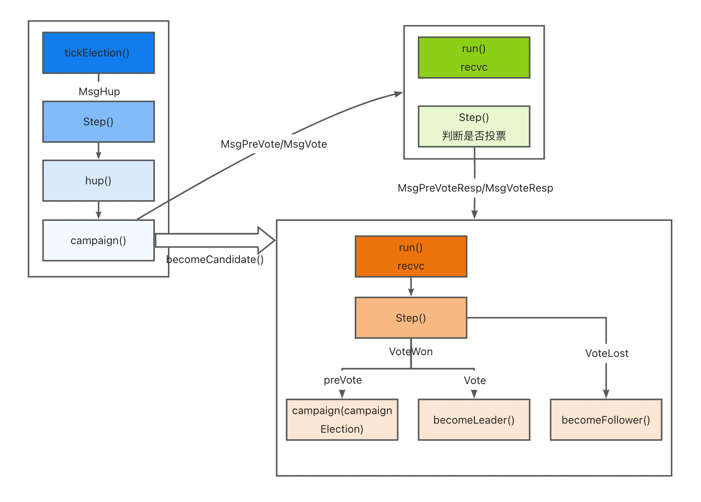
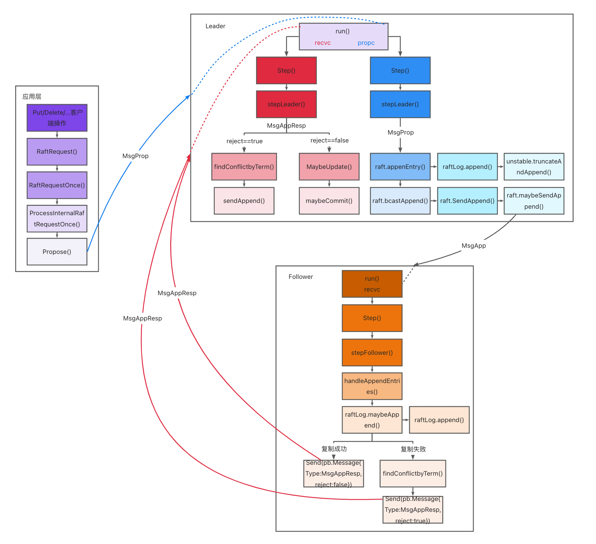

# 实现Raft算法

本实验基于etcd代码改动而成。主要任务为实现etcd中Raft算法。

此次实验分为两部分，包括领导者选举及日志复制。请根据注释提示，完成代码填充，所有需要填充的代码均在**./raft/raft.go**文件中。

在完成实验后，可运行 ./raft/raftLab_test.sh以检验是否实现正确

## 1 前期准备

请确保已经安装 go>=1.19, make

（苹果电脑m1芯片及以上推荐使用linux虚拟机或服务器）

## 2 领导者选举

领导者选举部分注释标志为RaftLab Election。请根据注释的步骤，根据选举的逻辑将代码补充完整。



follower节点tick函数推进当前时间计数，如果发现一段时间内都未收到领导者消息，触发选举条件。其转变状态为candidate，并向集群中广播请求投票消息MsgVote。节点收到请求投票消息MsgVote，根据term和日志判断是否可以投票，回复投票消息MsgVoteResp。当candidate可以收到多数节点的投票消息，则成功当选，转变状态为leader并广播通知权威。

**任务步骤：**

需要填空的部分在./raft/raft.go中，以注释RaftLab Election标志

Step1：节点tick函数推进时间计数

​			更新electionTimeout，向前推进

Step2：触发选举条件，节点开始一轮新的选举

​			初始化electionElapsed，并触发处理MsgHup

Step3：follower节点开始选举，变更状态为candidate，并进行相关参数的初始化

​			设置state、term、vote、tick函数和step函数

Step4：candidate节点组织请求投票消息，向集群中节点广播，请求投票

​			参考preElection，设置voteMsg和term

Step5：follower节点收到请求投票消息，判断是否投票后进行回复。填充统一投票时发送回复消息

​			参考拒绝投票的请求，发送回复消息

Step6:  candidate选举成功，成为leader并且广播日志复制消息确认身份权威

​			调用etcd中成为leader和广播MsgApp消息的函数

## 3 日志复制

日志复制部分注释标志为RaftLab Replication，请根据注释的步骤，根据日志复制的逻辑将代码补充完整。



当上层发送MsgProp，说明有新的写入，触发开始进行日志项复制。领导者收到MsgProp消息，将新的日志项加入本地，然后向集群中广播日志复制消息MsgApp。其他节点收到日志复制消息MsgApp，调用handleAppendEntries函数尝试将复制到本地，将复制结果回复给领导者msgAppResp。当领导者收到多数节点复制成功的回复时，提交日志项，并将结果广播给其他节点。

**任务步骤：**

需要填空的部分在./raft/raft.go中，以注释RaftLab Replication标志

Step1: leader收到新的propose，将其写入本地日志

​			实际设置entries的term和index

Step2: leader向集群中广播新的日志项复制消息

​			调用etcd中实现广播MsgApp消息的函数

Step3: follower节点收到日志项复制消息，进行处理，尝试将新日志项写入本地日志

​			调用etcd中实现处理MsgApp消息的函数

Step4: leader收到日志复制消息的回复，尝试更新CommitIndex

​			调用etcd中试图更新commitIndex的函数

## 4 测试

在完成所有代码填充之后，在命令行中运行测试脚本。若显示PASS即为通过

```bash
cd raft
./raftLab_test.sh
```

## 5 编译及调试

如果完成代码填充后存在错误，可使用gdb调试

**编译**

```bash
# 在项目根目录
./build.sh
```

**本地单节点启动**

```bash
# server端启动
./bin/etcd -data-dir ./data -advertise-client-urls http://127.0.0.1:2379 -listen-client-urls http://127.0.0.1:2379 -listen-peer-urls http://127.0.0.1:2380
```

```bash
# client端
./bin/etcdctl --endpoints=http://localhost:2382 put foo test
./bin/etcdctl --endpoints=http://localhost:2382 get foo
```

**调试**

```bash
gdb ./bin/etcd
(gdb) b raft.go:590
(gdb) run --listen-client-urls -advertise-client-urls http://127.0.0.1:2379 -listen-client-urls http://127.0.0.1:2379 -listen-peer-urls http://127.0.0.1:2380
```

```bash
# client端
./bin/etcdctl --endpoints=http://localhost:2380 put foo test
```

